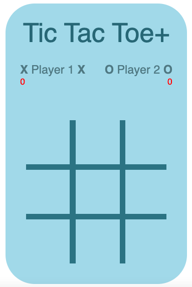

# Project0.0

This is the first attempt at the project0 tic-tac-toe project.

### Preview

#### Currently hosted at -
https://christopherdavidjohnson.github.io/Project-0.0/

##  ---- To Do List ----

1. Before inputing player names the tic-tac-toe crossword is reaching the edge of its containing div. Best solution is probably to make the board invisible until both user names are input.

2. Put in a reset game button for after a player wins rather than having to click on a firework.

3. Put in some sort of animation to let user know when they have had a draw game.

4. Better indication of who is X and who is O

#### Link to newer version (project 0.1) - still a work in progress
https://christopherdavidjohnson.github.io/Project-0.1/
